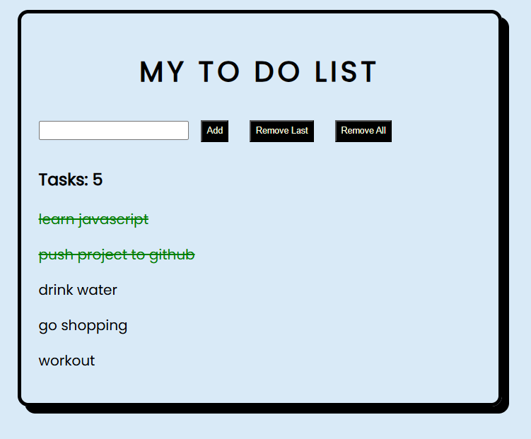

# To-Do List

This is my first JavaScript project. I built this project to understand how JavaScript makes a webpage interactive. While building this project, I also learnt how to use Git and GitHub for the first time.
# Features
- Add new tasks
- Remove the last task
- Remove all tasks
- Mark tasks as completed
- Task counter
- Saves tasks using Local Storage
# Built With
- HTML
- CSS
- JavaScript
# What I Learnt
- DOM Manipulation
- Event Listeners
- Arrays and Functions
- Local Storage
- JSON (`stringify()` and `parse()`)
- Git & GitHub
# How to Run
Open `index.html` in your browser.

Developer 
# PRANATHI HEGDE

